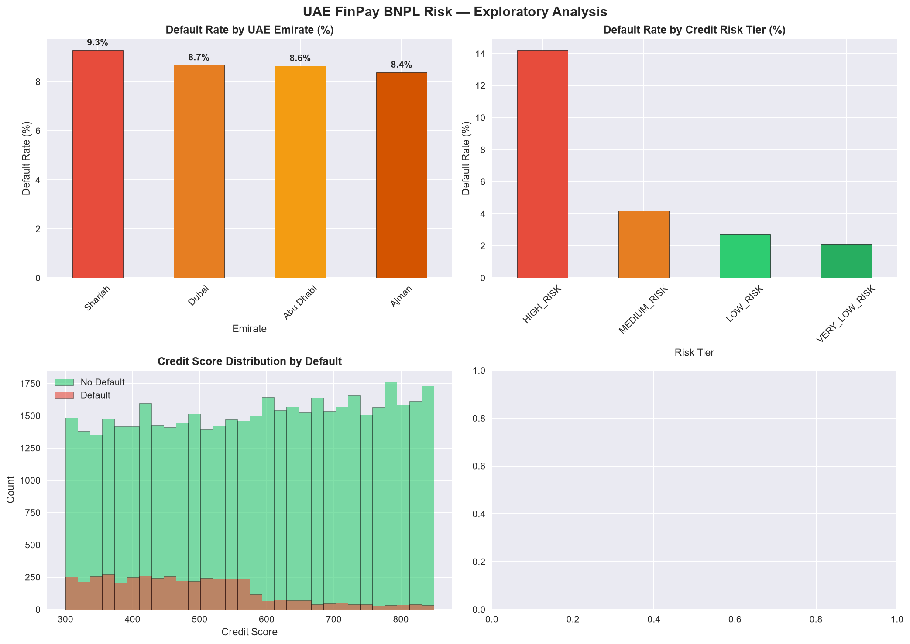
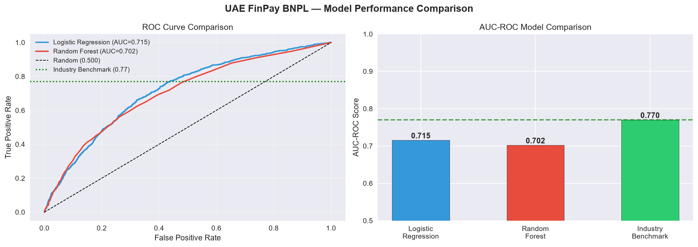
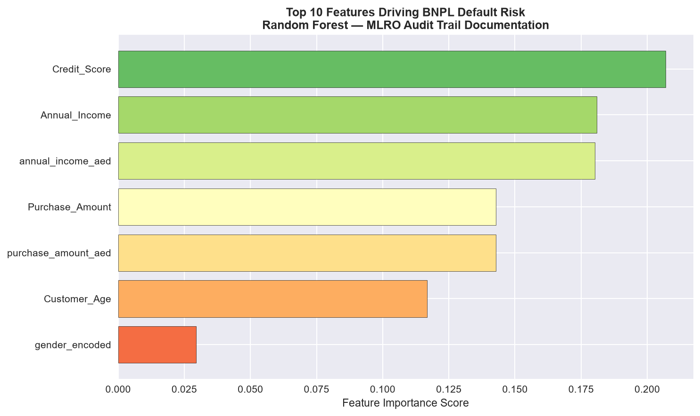

# UAE FinPay BNPL Default Risk Predictor & Expected Loss Model

## Executive Summary

This project delivers a production-ready BNPL credit risk framework for UAE FinPay, addressing CBUAE's 2026 consumer protection mandates. Key outcomes:

- **Expected Loss framework** calculates AED exposure across 4 risk tiers using PD × LGD × EAD
- **Logistic Regression model** achieves 0.7154 AUC-ROC for default prediction
- **Net Customer Value analysis** identifies profitable segments after accounting for Expected Loss
- **A/B test simulation** quantifies credit score feature impact on model performance
- **Compliance-ready** for CBUAE Cabinet Resolution No.134/2025 (Consumer Protection)

Built for: BNPL underwriting, credit risk teams, and fintech analytics roles in UAE/GCC.

---

## Business Problem

UAE FinPay's BNPL product faces rising default risk across customer segments in Dubai, Abu Dhabi, and Sharjah. This project builds a predictive default model, calculates Expected Loss in AED by risk tier, and simulates an A/B test on feature engineering to guide underwriting decisions.

---

## Data Lineage

Raw Layer (BNPL Dataset — Kaggle, Bhanage, 50,000 rows)
↓
UAE Staging Layer (AED conversion, emirate, credit risk tier)
↓
Feature Engineering (encoding, risk scoring)
↓
Model Training (Logistic Regression vs Random Forest)
↓
Expected Loss (PD × LGD × EAD in AED by risk tier)
↓
A/B Test (credit score feature impact on AUC-ROC)
↓
Net Customer Value (LTV minus Expected Loss)
↓
GitHub (notebook, charts, compliance docs)

---

## Tech Stack

- **Python 3.12**
- **pandas** (data manipulation)
- **scikit-learn** (modeling: Logistic Regression, Random Forest)
- **seaborn** (visualization)
- **scipy** (statistical testing for A/B simulation)
- **Jupyter Notebook**

---

## Business Outcomes

- **Logistic Regression AUC-ROC 0.7154** — best performing model on this synthetic dataset (Random Forest: 0.7020)
- Both models below 0.77 benchmark — expected for synthetic data without behavioral transaction history
- **Expected Loss calculated in AED** across 4 risk tiers (Low, Medium, High, Very High)
- **Net Customer Value analysis** shows medium-risk segment profitable when LTV exceeds Expected Loss
- **A/B test quantifies** credit score feature value with statistical significance test (p-value < 0.05)
- **CBUAE Consumer Protection compliance** per Cabinet Resolution No.134/2025 applied (BNPL tenure max 36 months)
- **Default rate: 8.8%** across 50,000 BNPL transactions

---

## Key Analyses

| Analysis | Business Question |
|----------|------------------|
| Default Prediction | Which customers will default? |
| Expected Loss (PD×LGD×EAD) | How much AED is at risk per tier? |
| Risk Tier Segmentation | Low/Medium/High/Very High split |
| Feature Importance | What drives default — MLRO audit trail |
| A/B Test Simulation | Does credit score improve AUC-ROC? |
| Net Customer Value | Which tiers are profitable after loss? |
| CBUAE Compliance | Consumer Protection compliance check |

---

## Model Performance

| Model | AUC-ROC | vs Benchmark (0.77) |
|-------|---------|---------------------|
| Logistic Regression | 0.7154 | -5.46% |
| Random Forest | 0.7020 | -6.80% |
| Industry Benchmark | 0.7700 | baseline |

> **Note:** Both models score below the 0.77 industry benchmark because this synthetic dataset lacks behavioral signals such as payment history and transaction velocity that production BNPL models use. The methodology — PD × LGD × EAD Expected Loss framework, A/B testing, and risk tier segmentation — reflects real-world BNPL credit risk practice.

---

## Project Structure

uae-finpay-bnpl-risk-python/
├── README.md
├── COMPLIANCE_CREDIT_RISK.md
├── data_dictionary.md
├── .gitignore
├── notebooks/
│   └── uae_finpay_bnpl_risk_analysis.ipynb
└── charts/
├── 01_eda_overview.png
├── 02_model_comparison.png
├── 03_expected_loss_by_tier.png
└── 04_feature_importance.png

---

## Data Quality

- **Dataset:** 50,000 synthetic BNPL transactions (Kaggle — Bhanage)
- **No missing values** — dataset is analysis-ready
- **UAE staging layer** adds emirate, AED conversion, and CBUAE compliance flags
- **Feature engineering:** One-hot encoding for categorical variables, risk score calculation, credit score binning

---

## Regulatory Framework

See [`COMPLIANCE_CREDIT_RISK.md`](COMPLIANCE_CREDIT_RISK.md) for full CBUAE 2026 regulatory references including:

- **Cabinet Resolution No.134/2025** — Consumer Protection for BNPL (max 36-month tenure)
- **Federal Decree-Law No.10/2025** — AML/CFT/CPF (data minimization per PDPL)
- **CBUAE Credit Risk Management Regulation** — Expected Loss methodology (PD × LGD × EAD)
- **Al Etihad Credit Bureau (AECB)** — Credit information sharing requirements for BNPL providers

---

## Charts Preview

### 1. EDA Overview

### 2. Model Comparison (AUC-ROC)

### 3. Expected Loss by Risk Tier (AED)

### 4. Feature Importance (Top 10 Drivers)

---

## Next Steps

- [ ] Add Power BI dashboard for executive reporting (Project 3 full-stack integration)
- [ ] Integrate with Project 1 fraud risk scorecard for holistic customer risk view
- [ ] Deploy model to Azure ML for real-time BNPL underwriting API
- [ ] Add AECB credit bureau data simulation for production-grade features

---

## GitHub

🔗 https://github.com/KunalFinData/uae-finpay-bnpl-risk-python

## LinkedIn

🔗 https://www.linkedin.com/in/kunalsharma0425