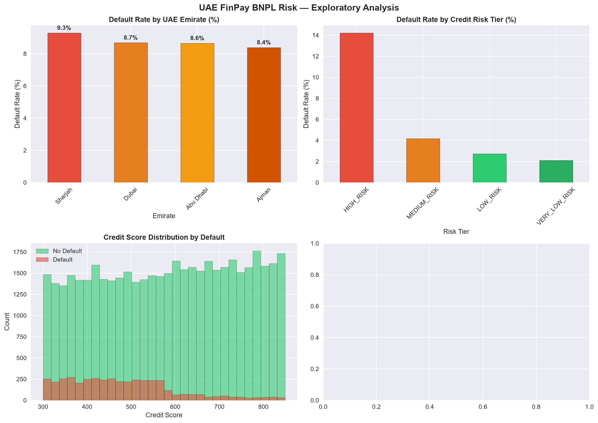
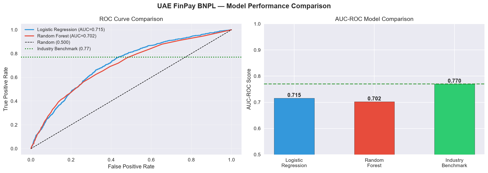
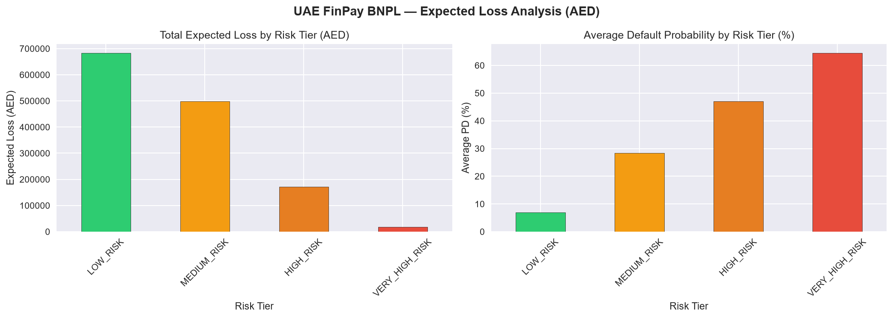
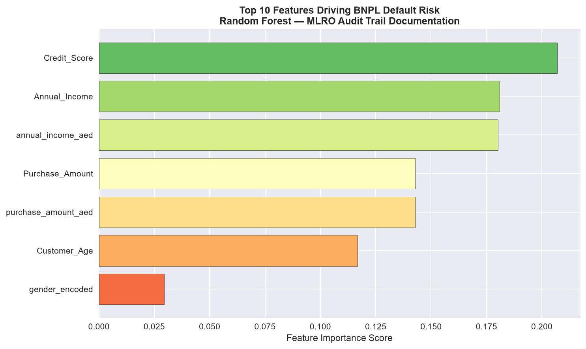

# UAE FinPay — BNPL Default Risk Predictor & Expected Loss Model

[](https://www.python.org/)
[](https://pandas.pydata.org/)
[](https://scikit-learn.org/)
[](https://jupyter.org/)
[](#)
[](LICENSE)

> A Python-based BNPL credit risk framework combining default prediction, Expected Loss, risk-tier segmentation, and customer profitability analysis for a UAE fintech use case.

UAE FinPay is a fictional company created for this portfolio to simulate a real-world credit risk analytics use case for a UAE fintech.

**Built for:** Credit Risk Analyst, Financial Data Analyst, Risk Analytics Analyst, Product Analytics Analyst, and Fintech BI Analyst.

---

## Executive Summary

This project builds a BNPL credit risk framework for a UAE fintech using Python, pandas, scikit-learn, and Jupyter Notebook. It combines default prediction with Expected Loss and profitability analysis to support underwriting decisions.

Rather than stopping at predicting default, the framework estimates Expected Loss using:

[
Expected Loss = PD \times LGD \times EAD
]

where:

- **PD:** Probability of Default
- **LGD:** Loss Given Default
- **EAD:** Exposure at Default

The project also evaluates Net Customer Value and compares Logistic Regression with Random Forest to identify an appropriate balance between predictive performance, explainability, and regulatory defensibility.

---

## Key Findings


- Logistic Regression achieved an AUC-ROC of **0.7154**, outperforming Random Forest at **0.7020** on this dataset.
- Medium-risk customers remained profitable after Expected Loss was deducted.
- Adding credit score improved predictive performance with statistical significance in the simulated A/B test.
- The portfolio default rate was **8.8%** across **50,000 BNPL transactions**.
- The framework demonstrates how credit risk analytics can support underwriting, portfolio monitoring, and profitability-based decision-making.

---

## Table of Contents

- [Executive Summary](#executive-summary)
- [Key Findings](#key-findings)
- [Business Problem](#business-problem)
- [Business Objectives](#business-objectives)
- [Data Lineage](#data-lineage)
- [Tech Stack](#tech-stack)
- [Skills Demonstrated](#skills-demonstrated)
- [Success Metrics](#success-metrics)
- [Executive Findings](#executive-findings)
- [Key Analyses](#key-analyses)
- [Model Performance](#model-performance)
- [Business Impact](#business-impact)
- [Business Recommendations](#business-recommendations)
- [Explainability and Governance](#explainability-and-governance)
- [How to Run](#how-to-run)
- [Project Structure](#project-structure)
- [Data Quality](#data-quality)
- [Limitations](#limitations)
- [Regulatory Framework](#regulatory-framework)
- [Charts Preview](#charts-preview)
- [Quick Links](#quick-links)
- [Contact](#contact)

---

## Business Problem

BNPL providers need more than a default probability score when making lending decisions. Risk teams must understand:

- Which customers are most likely to default.
- How much financial exposure exists within each risk tier.
- Whether customer segments remain profitable after accounting for credit losses.
- Which variables contribute most to model decisions.
- Whether additional data sources justify their implementation cost.

Without these insights, underwriting decisions rely primarily on intuition rather than measurable portfolio risk. This project builds a credit risk analytics framework that supports portfolio monitoring, underwriting strategy, and profitability analysis.

---

## Business Objectives

- Predict customer default probability.
- Calculate Expected Loss using the (PD \times LGD \times EAD) framework.
- Segment customers into actionable risk tiers.
- Evaluate model performance using industry-standard metrics.
- Identify key default drivers through feature importance.
- Assess customer profitability after Expected Loss.
- Simulate the business value of integrating additional credit information.

---

## Data Lineage

```
Raw Layer (BNPL Dataset — Kaggle, Bhanage, 50,000 rows)
↓
UAE Staging Layer (AED conversion, emirate, credit risk tier)
↓
Feature Engineering (encoding, risk scoring)
↓
Model Training (Logistic Regression vs Random Forest)
↓
Expected Loss (PD × LGD × EAD in AED by risk tier)
↓
A/B Test (credit score feature impact on AUC-ROC)
↓
Net Customer Value (LTV minus Expected Loss)
↓
GitHub (notebook, charts, compliance docs)
```


---

## Tech Stack

- **Python 3.12**
- **pandas** (data manipulation)
- **scikit-learn** (modeling: Logistic Regression, Random Forest)
- **seaborn** (visualization)
- **scipy** (statistical testing for A/B simulation)
- **Jupyter Notebook**

---

## Success Metrics (KPIs)

| KPI | Description | Business Use |
|---|---|---|
| Default Rate | Percentage of customers expected to default | Portfolio health monitoring |
| Expected Loss ((PD \times LGD \times EAD)) | Expected financial loss in AED | Credit risk provisioning |
| Net Customer Value | Lifetime Value minus Expected Loss | Profitability-based underwriting |
| AUC-ROC | Model discrimination ability | Model performance evaluation |
| Precision | Percentage of predicted defaults that actually default | Reduce unnecessary customer declines |
| Recall | Percentage of actual defaults correctly identified | Detect high-risk borrowers |
| Risk Tier Distribution | Customers segmented into Low, Medium, High and Very High | Portfolio risk monitoring |
| Feature Importance | Most influential default drivers | Model explainability and governance |

---

## Executive Findings

| Finding | Business Impact |
|---|---|
| Portfolio default rate is 8.8% | Establishes portfolio baseline risk |
| Logistic Regression outperforms Random Forest | Simpler and more explainable model is suitable for deployment |
| Medium-risk customers remain profitable | Opportunity to expand approvals without excessive risk |
| Expected Loss varies significantly across tiers | Enables risk-based pricing and credit limits |
| Credit score improves predictive performance | Supports future AECB integration |
| Models remain below industry benchmark | Highlights value of richer behavioural data rather than more complex algorithms |

---

## Key Analyses

| Analysis | Business Question |
|---|---|
| Default Prediction | Which customers are most likely to default? |
| Expected Loss ((PD \times LGD \times EAD)) | How much financial exposure exists by risk tier? |
| Risk Tier Segmentation | How should customers be categorised? |
| Feature Importance | Which variables drive default? |
| A/B Test Simulation | Does credit score improve predictive performance? |
| Net Customer Value | Which customer segments remain profitable? |
| Regulatory Compliance | Does the framework support responsible BNPL lending? |

---

## Model Performance

| Model | AUC-ROC | Benchmark Comparison |
|---|---|---|
| Logistic Regression | 0.7154 | -5.46% |
| Random Forest | 0.7020 | -6.80% |
| Industry Benchmark | 0.7700 | Baseline |

> **Note:** Both models score below the 0.77 industry benchmark because this dataset lacks behavioural signals such as payment history and transaction velocity, which production BNPL models typically rely on. That gap is a data-availability constraint rather than a modeling failure; the (PD \times LGD \times EAD) framework, A/B testing approach, and tier segmentation reflect how BNPL credit risk is assessed in practice, independent of this dataset's limits.

---

## Project Structure

```
uae-finpay-bnpl-risk-python/
├── README.md
├── COMPLIANCE_CREDIT_RISK.md
├── data_dictionary.md
├── .gitignore
├── notebooks/
│   └── uae_finpay_bnpl_risk_analysis.ipynb
└── charts/
    ├── 01_eda_overview.png
    ├── 02_model_comparison.png
    ├── 03_expected_loss_by_tier.png
    └── 04_feature_importance.png
```

---

## Business Impact

The model output is structured as an underwriting decision framework, not a standalone accuracy score:

- Expected Loss by tier lets a risk team quantify exposure in AED per risk band rather than treating default risk as one undifferentiated number.
- Net Customer Value answers the underwriting question that matters most: not whether a customer may default, but whether the segment remains profitable after expected loss is accounted for.
- The A/B test on credit score provides a data-backed assessment of whether the feature is worth the integration cost, including AECB access and compliance overhead, before committing to production.

---

## Business Recommendations

- Approve BNPL applications in the Medium-risk tier by default, since Net Customer Value remains positive after Expected Loss is deducted.
- Apply tighter per-customer limits to High and Very High tiers rather than outright decline, because smaller ticket sizes may still carry positive lifetime value.
- Prioritize AECB credit bureau integration over further model architecture changes, since better input data is likely to produce higher portfolio value than testing additional algorithms on the same feature set.
- Choose Logistic Regression for production because it offers a strong balance of predictive performance, interpretability, and regulatory defensibility.
- Monitor Expected Loss regularly and recalibrate PD, LGD, and EAD assumptions as portfolio performance evolves.
- Use Net Customer Value alongside Expected Loss to support risk-adjusted pricing and portfolio optimization.

---

## Limitations

- The dataset is synthetic rather than real BNPL repayment history.
- PD, LGD, and EAD parameters are estimated for this analysis, not calibrated against actual loss history.
- The A/B test is a simulation on historical/synthetic data, not a live randomized rollout.
- No macroeconomic or seasonality variables are included, such as salary-cycle timing or seasonal spending patterns relevant to the UAE market.
- Model performance below the 0.77 benchmark reflects the dataset's lack of behavioural and transactional history rather than a limitation of the Expected Loss or Net Customer Value methodology.

---

## Data Quality

- **Dataset:** 50,000 synthetic BNPL transactions (Kaggle — Bhanage)
- **No missing values** — dataset is analysis-ready
- **UAE staging layer** adds emirate, AED conversion, and CBUAE compliance flags
- **Feature engineering:** One-hot encoding for categorical variables, risk score calculation, credit score binning

---

## Regulatory Framework

See [`COMPLIANCE_CREDIT_RISK.md`](COMPLIANCE_CREDIT_RISK.md) for full CBUAE 2026 regulatory references including:

- **Cabinet Resolution No.134/2025** — Consumer Protection for BNPL (max 36-month tenure)
- **Federal Decree-Law No.10/2025** — AML/CFT/CPF (data minimization per PDPL)
- **CBUAE Credit Risk Management Regulation** — Expected Loss methodology (PD × LGD × EAD)
- **Al Etihad Credit Bureau (AECB)** — Credit information sharing requirements for BNPL providers

---

## Charts Preview

### 1. EDA Overview


### 2. Model Comparison (AUC-ROC)


### 3. Expected Loss by Risk Tier (AED)


### 4. Feature Importance (Top 10 Drivers)



---

## LinkedIn
[Connect on LinkedIn](https://www.linkedin.com/in/kunalsharma0425)

---